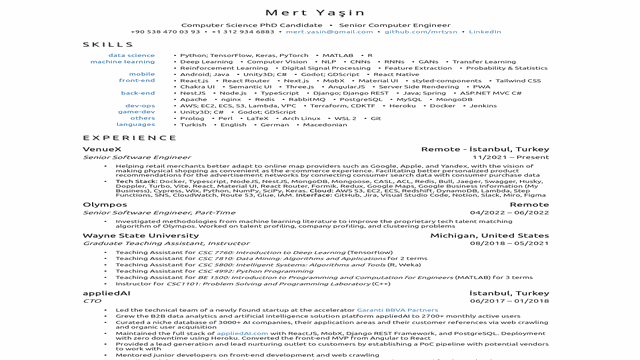

### 📝 CV

- CV of Mert Yaşin as a single page React application

### 🔗 Online Demo

- Visit [mrtysn.github.io/cv](https://mrtysn.github.io/cv/)

### 🖨️ How to create a PDF locally

- Start the project in development mode with `yarn start`

- Go to http://localhost:3000 on Google Chrome

- Remove the margins at the top and the bottom of the page manually (i.e. delete divider elements)

- Open the print dialog

- Set A4 as the page size

- Enable "background graphics"

- Save as PDF

### 🛠️ How to deploy to GitHub Pages

<!-- wrap in code block -->
- `pnpm run predeploy`
- `pnpm run deploy`

### 🖨️ How to create a PDF online

- Visit [mrtysn.github.io/cv](https://mrtysn.github.io/cv/) on Google Chrome

- Remove the margins at the top and the bottom of the page manually (i.e. delete divider elements)

- Open the print dialog

- Set A4 as the page size

- Enable "background graphics"

- Save as PDF
